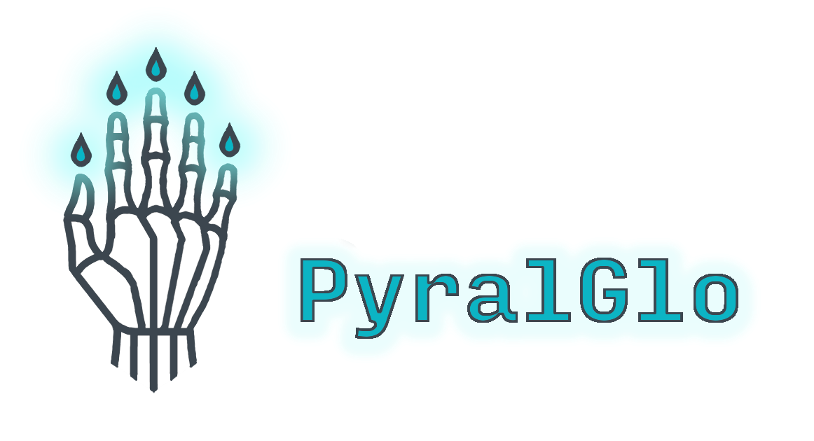

# v1.0 Roadmap TODO

- [ ] Basic Framework
	- Just get the bones in place, they will be updated and built upon as subsequent pieces are built
	- [ ] Basic CLI Tool
		- [ ] Creates basic folder structure
			- [ ] Hint structure
		- [ ] Creates basic encryption for config
			- [ ] Accept both keyring and os.environ.get
				- [ ] os.environ.get for headless linux
				- [ ] keyring for windows and linux with desktop environment
	- [ ] Basic self-validation
- [ ] Create Basic credential validation objects
	- [ ] Dirpath validator
		- Fast and easy.  Just check existence and isdir
	- [ ] Filepath validator
		- [ ] Read/write permission checker
			- [ ] Atomic write/unwrite testing
				- Subsequent tools may need to be aware of these test-writes so they can be cleaned up if this atomic operation ever executes in a less-than-atomic way
	- [ ] Internal URL validator
		- [ ] HTTP gethead requests
	- [ ] Environment Variable tester
		- [ ] sample loc for test decryption
	- [ ] API Key Tester
		- [ ] Session factory
			- [ ] requests.Session()
			- [ ] aiohttp.ClientSession()
				- If multiple endpoints are tested simultaneously, this is the more performant option
				- [ ] Given default values for parity with requests.Session
		- [ ] Endpoint testing
			- [ ] Basic health check endpoint
			- [ ] Optional additional endpoints
	- [ ] Secret Manager Tests
		- These will be difficult without maintaining subscriptions to these services
		- These should, in general, simply check that a key has been distributed.  If the key is to be validated further it must be defined again
		- [ ] HashiCorp Vault
		- [ ] AWS Secrets Manager
		- [ ] Azure Key Vault
	- [ ] SQL credential tests
		- [ ] Cover multiple engines
			- [ ] MySQL
			- [ ] Postgres
			- [ ] Microsoft SQL
			- [ ] Oracle
			- [ ] SQLite
		- [ ] engine attribute
	- [ ] Cloud service credential validation:
		- [ ] AWS
		- [ ] Azure
	- [ ] Cryptographic key credentials
		- [ ] TPM
	- [ ] Data Warehouse/ DataLake:
		- [ ] Snowflake
		- [ ] Big Query
		- [ ] Databricks
	- [ ] NoSQL Credentials
		- [ ] MongoDB
		- [ ] Redis
		- [ ] DynamoDB
		- [ ] Neo4j
- [ ] Additional CLI Tools
	- [ ] Centralized package vault
	- [ ] Key Rotation
		- [ ] Self Directed
		- [ ] Attachment point for distributed systems
- [ ] **STRETCH GOALS**
	- [ ] Atomic key-rotation extensions written in Rust or alternative (Need to be as fast and low resource as possible to be atomic)